Welcome to the Smallest AI Client Libraries documentation. Our client libraries provide easy-to-use interfaces for integrating Smallest AI's powerful capabilities into your applications.

## Server-Side SDKs

- [Python](https://github.com/smallest-inc/smallest-python-sdk)
- [Node](https://github.com/smallest-inc/smallest-node-sdk)

## Client-Side SDK

### Atoms Multimodal SDK

A TypeScript/JavaScript SDK for real-time voice and text communication with AI agents using WebRTC technology. Built on Atoms' proprietary real-time communication infrastructure for robust, low-latency audio streaming and real-time data exchange.

## Web Integration: Voice and Text Chat

The Atoms Multimodal SDK enables you to integrate both voice and text-based AI agent interactions directly into your web applications. Whether you need voice calls or text chat, this single SDK handles both modes seamlessly.

<Note>
  **Important Security Note**: Your client code should call your server endpoint
  which internally calls `conversation/chat` or `conversation/webcall` to get
  the access token and other details for the session. The endpoints require
  using your Atoms API Key, which is the reason why you need to call the
  endpoint from your server instead of client to protect the key from exposing.
  You simply pass the `agentId` to these endpoints, and they handle all the
  setup internally. The access token and connection details obtained will be
  used in your frontend client code to start the session.
</Note>

### Token Flow Diagram

```mermaid
sequenceDiagram
    participant FE as 🌐 Frontend App
    participant BE as 🔒 Your Backend
    participant API as ⚛️ Atoms API
    participant WS as 🔗 WebRTC Server

    Note over FE,WS: Secure Token Flow & Connection Setup

    FE->>+BE: 1. Request Session
    Note over FE: Sends: { agentId: "agent_123" }

    BE->>+API: 2. POST /conversation/chat or /conversation/webcall
    Note over BE: Headers: { Authorization: "Bearer YOUR_API_KEY" }<br/>Body: { agentId: "agent_123" }

    API-->>API: Create room & generate<br/>secure access token

    API->>-BE: 3. Session Details
    Note over API: Returns:<br/>• token • host • roomName<br/>• conversationId • callId

    BE->>-FE: 4. Forward Session Data
    Note over BE: Secure proxy - API key never exposed

    FE->>+WS: 5. Connect SDK to WebRTC Server
    Note over FE: client.startSession({<br/>accessToken, mode, host})

    WS->>-FE: 6. Real-time Connection Established
    Note over FE,WS: Voice/Text chat active via WebRTC
```



### Installation

```bash
npm install atoms-client-sdk
```

### Quick Start - Voice Mode

```typescript
import { AtomsClient } from "atoms-client-sdk";

const client = new AtomsClient();

// Listen for events
client.on("session_started", ({ mode }) => {
  console.log(`Session started in ${mode} mode`);
});

client.on("transcript", (data) => {
  console.log("Agent said:", data.text);
});

client.on("agent_start_talking", () => {
  console.log("Agent started talking");
});

client.on("agent_stop_talking", () => {
  console.log("Agent stopped talking");
});

// Start voice session
await client.startSession({
  accessToken: "your-access-token",
  mode: "webcall",
  host: "wss://atoms-server.example.com",
});

// Don't forget to call startAudioPlayback() after user interaction
await client.startAudioPlayback();
```

### Quick Start - Text Mode

```typescript
import { AtomsClient } from "atoms-client-sdk";

const client = new AtomsClient();

// Listen for transcript responses
client.on("transcript", (data) => {
  console.log("Agent response:", data.text);
});

// Start text-only session
await client.startSession({
  accessToken: "your-access-token",
  mode: "chat",
  host: "wss://atoms-server.example.com",
});

// Send text messages
client.sendTextMessage("Hello, how can you help me today?");
```

## Key Features

### Voice Mode (webcall)

- **Real-time voice communication** with AI agents
- **Low-latency audio streaming** using WebRTC
- **Automatic audio processing** (echo cancellation, noise suppression)
- **Device selection** for microphone and speakers
- **Raw audio access** for advanced processing
- **Voice activity detection** for agent talking states

### Text Mode (chat)

- **Real-time text messaging** with AI agents
- **Instant responses** through WebSocket data channels
- **No audio permissions required**
- **Lightweight and fast** for text-only interactions

### Common Features

- **Event-driven architecture** for real-time updates
- **Automatic session management** and cleanup
- **Error handling** with detailed error events
- **Permission management** for microphone access
- **Cross-browser compatibility**

## Configuration Options

### StartSessionConfig Interface

```typescript
interface StartSessionConfig {
  accessToken: string; // JWT token for authentication
  mode: "webcall" | "chat"; // Communication mode
  host?: string; // Atoms server URL
}
```

## Event System

The SDK emits various events for real-time updates:

### Session Events

- `session_started` - Session successfully initiated
- `session_ended` - Session terminated
- `error` - Error occurred during session

### Permission Events (Voice Mode)

- `microphone_permission_granted` - Microphone access granted
- `microphone_permission_error` - Permission issues
- `microphone_access_failed` - Access failed during session start

### Agent Events

- `agent_connected` - AI agent joined the session
- `agent_start_talking` - Agent began speaking (voice mode)
- `agent_stop_talking` - Agent stopped speaking (voice mode)

### Communication Events

- `transcript` - Text message from agent (both modes)

## API Methods

### Core Methods

- `startSession(config)` - Initialize communication session
- `stopSession()` - End session and cleanup resources
- `startAudioPlayback()` - Enable audio (required after user interaction)

### Voice Mode Methods

- `mute()` - Mute microphone
- `unmute()` - Unmute microphone
- `checkMicrophonePermissions()` - Check mic permissions

### Text Mode Methods

- `sendTextMessage(message)` - Send text to agent

### Properties

- `isConnected` - Connection status
- `currentMode` - Current session mode
- `roomName` - Session room name
- `isAgentTalking` - Agent speaking status (voice mode)

## Example: Complete Implementation

```typescript
import { AtomsClient } from "atoms-client-sdk";

class AtomsChat {
  private client: AtomsClient;
  private mode: "webcall" | "chat";

  constructor(mode: "webcall" | "chat") {
    this.client = new AtomsClient();
    this.mode = mode;
    this.setupEventListeners();
  }

  private setupEventListeners() {
    // Session events
    this.client.on("session_started", ({ mode }) => {
      console.log(`${mode} session started`);
      this.updateConnectionStatus(true);
    });

    this.client.on("session_ended", () => {
      console.log("Session ended");
      this.updateConnectionStatus(false);
    });

    // Communication events
    this.client.on("transcript", (data) => {
      this.displayMessage("agent", data.text);
    });

    // Voice-specific events
    if (this.mode === "webcall") {
      this.client.on("agent_start_talking", () => {
        this.showAgentSpeaking(true);
      });

      this.client.on("agent_stop_talking", () => {
        this.showAgentSpeaking(false);
      });

      this.client.on("microphone_permission_error", (data) => {
        this.showError(`Microphone error: ${data.error}`);
      });
    }

    // Error handling
    this.client.on("error", (error) => {
      this.showError(`Session error: ${error}`);
    });
  }

  async connect(accessToken: string, host: string) {
    try {
      await this.client.startSession({
        accessToken,
        mode: this.mode,
        host,
      });

      // Enable audio for voice mode (must be called after user interaction)
      if (this.mode === "webcall") {
        await this.client.startAudioPlayback();
      }
    } catch (error) {
      this.showError(`Failed to connect: ${error}`);
    }
  }

  sendMessage(message: string) {
    if (this.mode === "chat") {
      this.client.sendTextMessage(message);
      this.displayMessage("user", message);
    }
  }

  toggleMute() {
    if (this.mode === "webcall") {
      // Implement mute state tracking
      this.client.mute(); // or unmute()
    }
  }

  disconnect() {
    this.client.stopSession();
  }

  // UI update methods (implement based on your framework)
  private updateConnectionStatus(connected: boolean) {
    // Update UI connection indicator
  }

  private displayMessage(sender: "user" | "agent", message: string) {
    // Add message to chat interface
  }

  private showAgentSpeaking(speaking: boolean) {
    // Show visual indicator when agent is talking
  }

  private showError(error: string) {
    // Display error message to user
  }
}

// Usage Examples

// Voice chat
const voiceChat = new AtomsChat("webcall");
await voiceChat.connect("your-jwt-token", "wss://atoms-server.example.com");

// Text chat
const textChat = new AtomsChat("chat");
await textChat.connect("your-jwt-token", "wss://atoms-server.example.com");
textChat.sendMessage("Hello!");
```

## Getting Your Access Token

To use the SDK, you'll need to call our backend API from your server to get the access token and connection details. Your backend should:

1. Have an existing agent created using the [Atoms API](/api-reference)
2. Call `POST atoms-api.smallest.ai/api/v1/conversation/chat` or `POST atoms-api.smallest.ai/api/v1/conversation/webcall` with the `agentId`
3. Return the token, host, and other session details to your frontend
4. Your frontend uses these details in the `startSession()` call

**Important**: Never expose your Atoms API key on the frontend. Always proxy through your backend server.

## Learn More

For complete documentation, advanced examples, and troubleshooting:

- **[NPM Package](https://www.npmjs.com/package/atoms-client-sdk)** - Install and view package details
- **[GitHub Repository](https://github.com/smallest-inc/atoms-sdk-example)** - Full source code, examples, and documentation

The Atoms Multimodal SDK makes it simple to add both voice and text AI agent interactions to your web applications.
