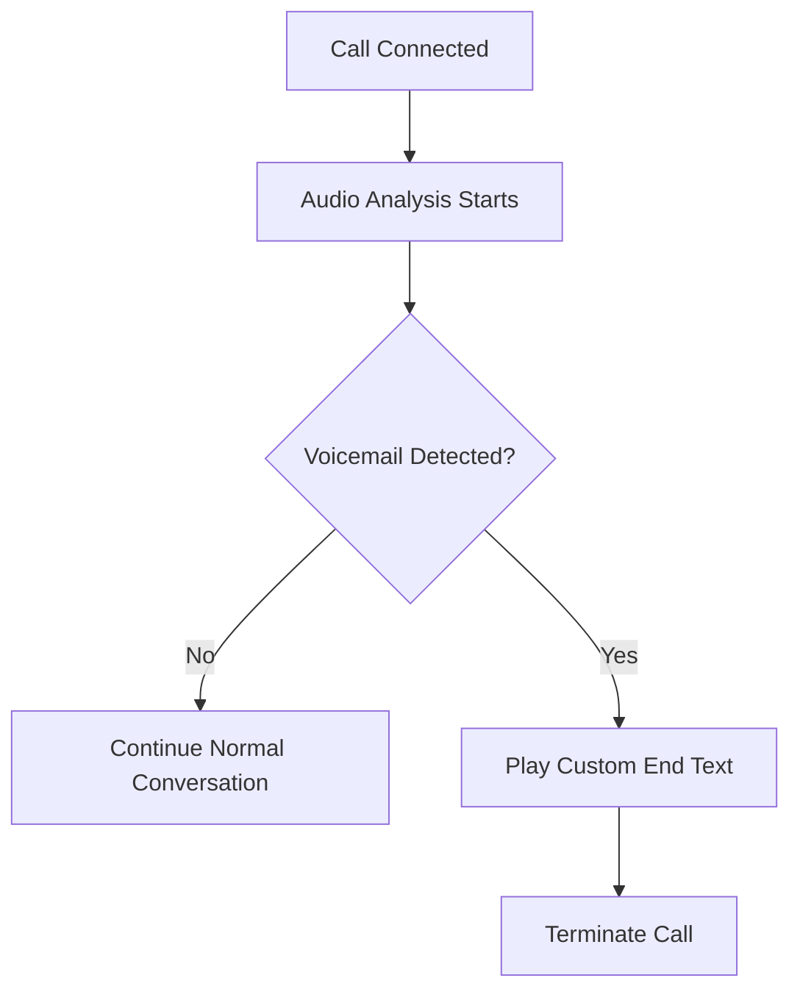

## Overview

Voicemail Detection is an intelligent feature that automatically identifies when a call reaches a voicemail system instead of a live person. When enabled, the system can detect voicemail scenarios and handle them appropriately by playing a custom end message before terminating the call.

This feature is particularly useful for outbound calling scenarios where you want to ensure your AI agent responds appropriately when encountering voicemail systems.

---

## How Voicemail Detection Works

### Detection Mechanism

The voicemail detection system uses advanced audio analysis to identify voicemail patterns by analyzing:

1. **Audio Patterns**: Recognizes common voicemail greeting structures and tones
2. **Speech Characteristics**: Detects the typical cadence and flow of automated voicemail messages
3. **Silence Detection**: Identifies the characteristic pause/beep pattern that indicates voicemail recording has begun
4. **Voice Detection Integration**: Works in conjunction with the voice detection system to ensure accurate timing

### Detection Process

---

## Configuration

### Enabling Voicemail Detection

To enable voicemail detection for your agent:

1. Navigate to your agent's configuration page
2. Scroll to the **Voice Configuration** section
3. Toggle **"Voicemail Detection"** to enabled
4. Configure your custom end text message

<Warning>
  If your voice detection release time is less than 0.6 seconds, voicemail detection may not work as expected.
  The system will warn you if this configuration issue is detected.
</Warning>

---

## Related Features

- [Voice Detection](../voice-config/understanding-voice-parameters) - Configure voice detection parameters
- [Call Logs](../call-logs/what-is-a-call-log) - Monitor voicemail detection in call logs
- [Webhooks](../webhooks/webhooks) - Get notified when voicemail is detected
- [Realtime Events](../realtime-events/events) - Track voicemail events in real-time

Voicemail detection helps ensure your AI agents handle all call scenarios professionally and appropriately. 📞
